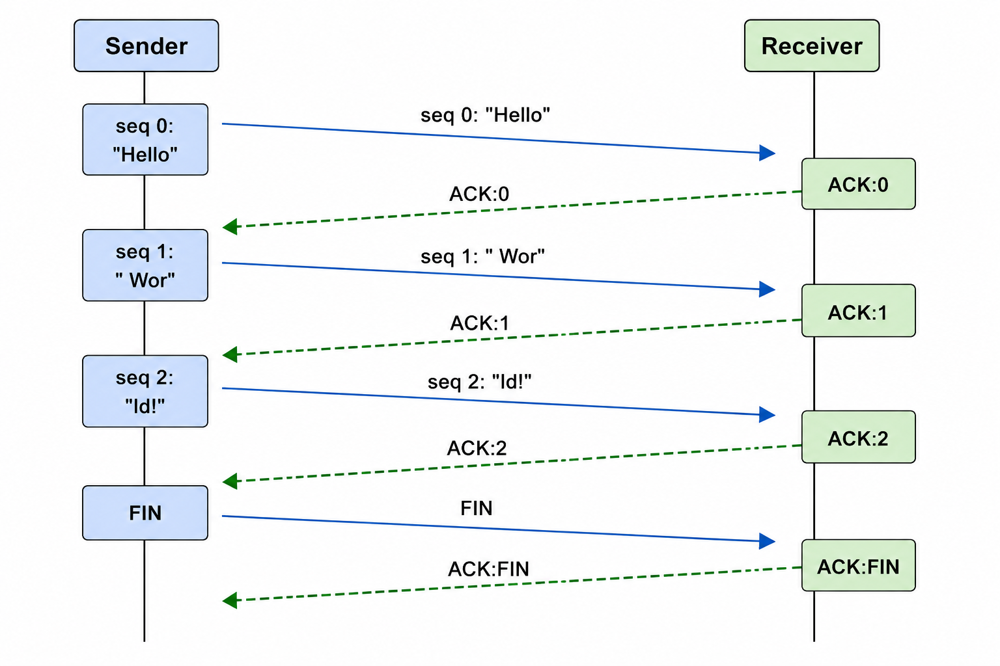
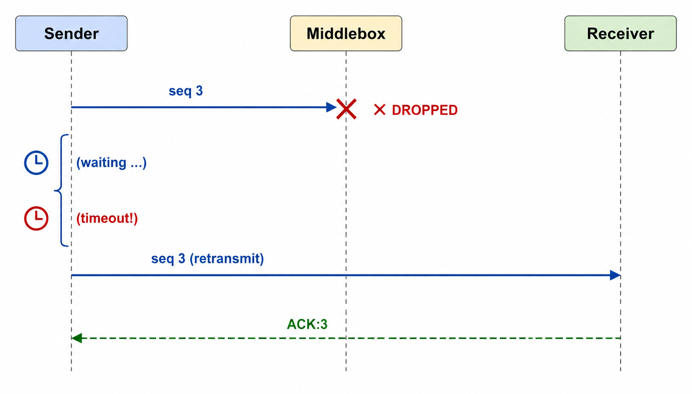
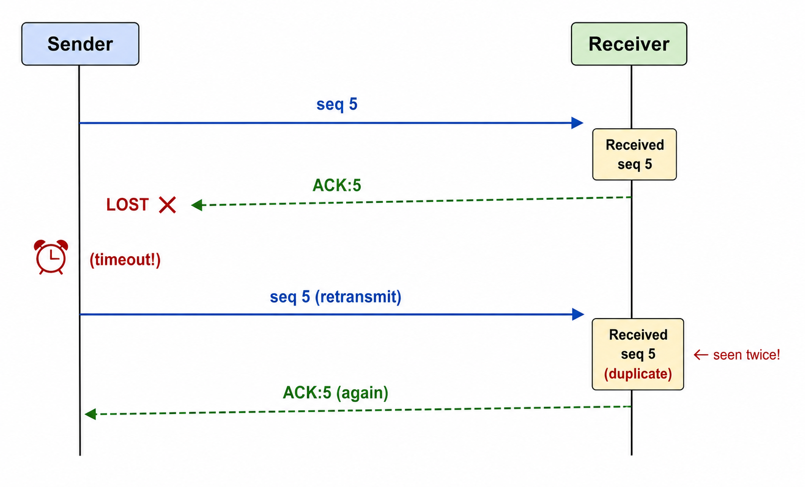

# Lab: Reliable Data Transfer over UDP

**Duration:** 60 minutes  
**Format:** Containerlab + Python  
**Topology:** Sender → Middlebox → Receiver

---

## What You Will Build

You are going to implement a **Stop-and-Wait Reliable Data Transfer** protocol
on top of bare UDP — no TCP, no QUIC, no framework.  By the end of the hour you
will have a working file transfer that survives packet loss, handles duplicates,
and produces identical bytes on the other side.

The lab is structured as a sequence of increasingly reliable versions.  Each
part builds on the previous one and introduces exactly one new concept, so you
can see clearly what problem each mechanism solves.

---

## Background (Read Before You Start)

### Why is UDP unreliable?

UDP (User Datagram Protocol) hands your bytes to the IP layer and forgets about
them.  The network may:

- **lose** the datagram silently
- **duplicate** it (rare but possible)
- **reorder** datagrams that take different paths

TCP solves all three.  You are going to build a minimal version of that
solution yourself.

### The vocabulary you need

| Term | Meaning |
|---|---|
| **Datagram** | One UDP message — the unit of delivery |
| **ACK** | Acknowledgement — receiver tells sender "I got it" |
| **Sequence number** | A counter that lets both sides track *which* datagram they are talking about |
| **Timeout / retransmit** | If no ACK arrives in time, send the datagram again |
| **Stop-and-Wait (ARQ)** | A simple policy: send one datagram, wait for its ACK, then send the next |
| **Duplicate** | A datagram that arrives twice (because an ACK was lost and the sender retransmitted) |

### The timeline of a successful transfer



### The timeline when a packet is lost



### The timeline when an ACK is lost (duplicate problem)



The receiver must detect that seq 5 is a **duplicate** and discard the data —
but it still sends the ACK so the sender can move on.

---

## Topology

```
[sender 10.0.1.1] ──── eth1/eth1 ──── [middlebox 10.0.1.2/10.0.2.2] ──── eth2/eth2 ──── [receiver 10.0.2.1]
```

The **middlebox** uses the Linux `tc netem` tool to inject configurable packet
loss.  You will change the loss rate during the lab and observe how the protocol
behaves.

```
apps/
  sender_baseline.py   # Part 0 – bare UDP, no reliability
  receiver_baseline.py # Part 0 – bare UDP receiver
  sender_rdt.py        # Parts 2-4 – stop-and-wait with ACK + retransmit
  receiver_rdt.py      # Parts 2-4 – receiver with duplicate detection
  sender_window.py     # Bonus – sliding window (Go-Back-N)
  set-loss.sh          # Helper: set netem loss % on the middlebox
  gen-input.sh         # Helper: create a test file on the sender
  verify.sh            # Helper: compare input vs output hashes
```

---

## Setup (Pre-lab, ~5 minutes)

### 1. Prerequisites -- We had already done

```bash
# Docker and Containerlab must be installed
docker --version
containerlab version
```

### 2. Build the image -- Redo it, we have minor changes

```bash
docker build -t alpine-nettools:latest alpine-nettools
```

The lab uses the `alpine-nettools` image (same as the linear-routing lab).
If you do not have it:

```bash
docker build -t alpine-nettools:latest alpine-nettools
FROM alpine:3.19
RUN apk add --no-cache python3 iproute2 tcpdump iputils
EOF
```

### 3. Deploy the topology

Change Directory
```bash
cd rdt
```
Then deploy the containers

```bash
sudo containerlab deploy -t rdt.clab.yml
```

You should see three containers:

```
clab-rdt-lab-sender
clab-rdt-lab-middlebox
clab-rdt-lab-receiver
```

### 4. Open your terminals

Open **three** terminals and pin each to one container:

```bash
# Terminal A — Sender
docker exec -it clab-rdt-lab-sender sh

# Terminal B — Receiver
docker exec -it clab-rdt-lab-receiver sh

# Terminal C — Middlebox
docker exec -it clab-rdt-lab-middlebox sh
```

### 5. Verify reachability

```bash
# From sender terminal
ping -c 2 10.0.2.1
```

You should get replies.  If not, re-check the exec commands in the YAML ran
correctly: `ip addr show`.

### 6. Generate the test file

```bash
# Terminal A (sender)
sh /apps/gen-input.sh        # creates /tmp/input.txt (32 KB by default)
```

---

## Part 0 — Baseline: Bare UDP (5 min)

### Goal

See that raw UDP *works* on a perfect network — and understand what "reliable"
means by seeing what happens without it.

### Step 1: Run on a perfect network (no loss)

**Terminal B (receiver):**
```bash
python3 /apps/receiver_baseline.py
```

**Terminal A (sender):**
```bash
python3 /apps/sender_baseline.py
```

The receiver prints the byte count and writes `/tmp/output.txt`.

### Step 2: Verify the transfer

```bash
# Terminal X on the host itself
cd rdt
sh apps/verify.sh
```

You should see `✓ MATCH`.

### Step 3: Introduce loss

**Terminal C (middlebox):**
```bash
tc qdisc replace dev eth2 root netem loss 30%
```

Verify Loss

**Terminal B (receiver):**
```bash
iperf3 -s
```

**Terminal A (sender):**
```bash
iperf3 -c 10.0.2.1 -u -b 10M -t 10
```

Run the transfer again:

```bash
# Terminal B — restart receiver
python3 /apps/receiver_baseline.py

# Terminal A — send again
python3 /apps/sender_baseline.py
```

> **Discussion question:** What happened?  
> The sender sent the file and exited immediately.  The receiver either got it
> or did not — there was no way to know.  With 30% loss the single datagram
> will be dropped about a third of the time.  Run it a few times.

This is the fundamental unreliability problem.  The rest of the lab fixes it.

---

## Part 1 — Understanding the Problem (10 min)

Before writing code, let's make sure the failure modes are completely clear.

### The problem: sender has no feedback

Draw this on paper or think through it:

```
Scenario A: packet lost in transit
  Sender sends → ✗ LOST → Receiver never gets it
  Sender just... waits. Or exits. No idea what happened.

Scenario B: packet arrives, ACK lost
  Sender sends → Receiver gets it → ACK → ✗ LOST
  Sender thinks: "I never got a confirmation."
  Sender retransmits → Receiver gets it AGAIN
```

> **Discussion question:** In Scenario B, what would happen if the receiver
> writes the data to the file every time it arrives, without checking for
> duplicates?

Answer: the output file would contain duplicated data and the MD5 check
would fail — even though no data was actually "lost".

This tells us we need **three** things, not just one:

1. **ACKs** so the sender knows a packet arrived
2. **Retransmission with timeout** so the sender recovers from loss
3. **Sequence numbers** so the receiver can detect and discard duplicates

### Inspect the packet format

Open `sender_rdt.py` and `receiver_rdt.py` and find:

- Where the sequence number is embedded in the datagram
- Where the receiver parses the sequence number back out
- Where the duplicate-detection logic lives

---

## Part 2 — Add ACKs and a Stop-and-Wait Loop (15 min)

Reset loss to 0% before this part:

```bash
# Terminal C
tc qdisc replace dev eth2 root netem loss 0%
```

### The protocol you are implementing

```
Sender loop:
  for each chunk:
    send  "<seq>|<data>"
    wait for "ACK:<seq>"
    move to next chunk

Receiver loop:
  recv packet
  parse seq and data
  send "ACK:<seq>"
  store data
```

### Step 1: Read the code

Before running anything, read through `sender_rdt.py` (the `send_file` function)
and `receiver_rdt.py` (the `receive_file` function).  Answer:

- What does the `while True:` loop inside the `for seq, chunk` loop do?
- What exception does `sock.settimeout` cause?
- Why does the receiver always send an ACK, even for duplicates?

### Step 2: Run at 0% loss

**Terminal B:**
```bash
python3 /apps/receiver_rdt.py
```

**Terminal A:**
```bash
python3 /apps/sender_rdt.py
```

You should see a line for every ACK and a summary at the end.

```bash
# Terminal A
sh apps/verify.sh     # should show ✓ MATCH
```

> Note the transfer time and throughput printed by the sender.  You will
> compare these numbers as you increase loss.

---

## Part 3 — Retransmission Under Loss (15 min)

Now inject real loss and watch the protocol recover.

### Step 1: 10% loss

**Terminal C:**
```bash
tc qdisc replace dev eth2 root netem loss 10%
```

**Terminal B (restart):**
```bash
python3 /apps/receiver_rdt.py
```

**Terminal A:**
```bash
python3 /apps/sender_rdt.py
```

Watch the sender output.  You should occasionally see:

```
[sender] ✗ timeout on seq 7, retransmitting …
```

Check the summary: how many retransmissions?

### Step 2: 30% loss

```bash
# Terminal C
tc qdisc replace dev eth2 root netem loss 30%
```

Repeat the transfer.  Fill in this table:

| Loss Rate | Transfer Time | Retransmissions | Throughput (KB/s) |
|-----------|---------------|-----------------|-------------------|
| 0%        |               |                 |                   |
| 10%       |               |                 |                   |
| 30%       |               |                 |                   |
| 50%       |               |                 |                   |

```bash
# Always verify correctness!
sh /apps/verify.sh
```

> **Discussion question:** At 30% loss, approximately how many extra round
> trips does each packet need on average?  Does the relationship between loss
> rate and transfer time look linear?

### Step 3: 50% loss

```bash
# Terminal C
tc qdisc replace dev eth2 root netem loss 50%
```

At 50% loss, the expected number of transmissions per packet is
`1 / (1-0.5) = 2`.  Does your measurement match?

> **Key insight:** Stop-and-Wait works correctly at any loss rate — it is just
> slow.  The protocol is correct; the throughput is poor.

---

## Part 4 — Duplicate Detection (10 min)

Reset to 0% loss:

```bash
tc qdisc replace dev eth2 root netem loss 0%
tc qdisc replace dev eth1 root netem loss 20%
```

### Why duplicates happen even without a lossy network

Consider what happens when the **ACK** is lost, not the data packet:

1. Sender sends seq 5 → Receiver gets it, sends ACK 5
2. ACK 5 is lost in transit
3. Sender times out → retransmits seq 5
4. Receiver gets seq 5 **again**

Without duplicate handling, the receiver would write the seq 5 data twice.

### Where is this handled in the code?

Look at `receiver_rdt.py`:

```python
if seq == expected_seq:
    chunks[seq] = payload
    expected_seq += 1
    print(f"[receiver] ✓ seq {seq:4d} ...")
elif seq < expected_seq:
    pkts_dup += 1
    print(f"[receiver] dup seq {seq:4d} (expected {expected_seq}) → ACK re-sent")
```

The receiver:

- **Accepts** the packet only if `seq == expected_seq`
- **Discards the data** if `seq < expected_seq` (duplicate), but still sends the ACK
- **Always** sends an ACK — even for duplicates — so the sender can advance

### Simulate a duplicate manually

You can test this without a lossy network.  In a separate terminal, send the
same seq twice to the receiver while it is running:

**Terminal B (restart):**
```bash
python3 /apps/receiver_rdt.py
```

**Terminal A:**
```bash
python3 /apps/sender_rdt.py
```

The receiver should report 1 unique packet and 1 duplicate.

> **Discussion question:** What would happen if we did NOT send an ACK for
> duplicates?  Trace through the sender's while loop.

---

## Part 5 — Teardown and Reflection (5 min)

```bash
# From your host (outside containers)
sudo containerlab destroy -t rdt.clab.yml
```

### Results discussion

Review the table you filled in during Part 3.

1. **Throughput vs. loss:** Does throughput drop linearly with loss, or faster?
   Why?  (Hint: think about cascading timeouts.)

2. **Stop-and-Wait inefficiency:** At 0% loss, what fraction of the time is the
   sender *idle* waiting for ACKs?  What would help?

3. **Sequence numbers:** Could you build a correct protocol with only 1-bit
   sequence numbers (0 and 1 alternating) for Stop-and-Wait?  This is called
   the Alternating Bit Protocol — look it up.

4. **TCP analogy:** Which fields in a TCP header correspond to the mechanisms
   you just implemented?

   | Your mechanism | TCP header field |
   |---|---|
   | Sequence number | Sequence Number |
   | ACK message | Acknowledgement Number + ACK flag |
   | Timeout / retransmit | Retransmission Timer (RTO) |
   | FIN | FIN flag |

---

## Bonus — Sliding Window (Go-Back-N)

If you finish early, try the sliding window sender.  The receiver (`receiver_rdt.py`)
is already compatible — it handles out-of-order seq numbers gracefully.

```bash
# Reset to 10% loss
tc qdisc replace dev eth2 root netem loss 10%

# Terminal B
python3 /apps/receiver_rdt.py

# Terminal A — window of 4
WINDOW=4 python3 /apps/sender_window.py
```

Compare throughput to `sender_rdt.py` (window=1).  Try window sizes of 1, 4, 8, 16.

| Window Size | Throughput (KB/s) |
|---|---|
| 1 (stop-and-wait) | |
| 4 | |
| 8 | |
| 16 | |

> **Discussion question:** Does throughput keep increasing with window size?
> At what point does it stop helping, and why?

The window should saturate the link at around `bandwidth-delay product` worth of
packets in flight.  This is exactly how TCP's congestion window works.

---

## Deliverables

Submit a short report (one page is fine) containing:

1. Your filled-in performance table (Part 3)
2. Answers to the three reflection questions (Part 5)
3. One sentence each explaining:
   - Why ACKs alone are not enough
   - Why sequence numbers alone are not enough
   - Why you need both together

---

## Troubleshooting

**`ping` fails between containers**  
Re-check that the `exec` commands in the YAML ran correctly.  Inside the
container, `ip addr show` should list the expected IP on `eth1` or `eth2`.

**Receiver exits immediately without receiving anything**  
Make sure you start the receiver *before* the sender.

**`tc: command not found`**  
The `alpine-nettools` image needs `iproute2`.  Rebuild with the Dockerfile
in the Setup section.

**`verify.sh` says MISMATCH even at 0% loss**  
Check that both `/tmp/input.txt` and `/tmp/output.txt` are on the **same
container** (they are not shared).  The verify script compares files locally.
To compare across containers, print the MD5 from each:

```bash
# On sender
md5sum /tmp/input.txt

# On receiver
md5sum /tmp/output.txt
```
